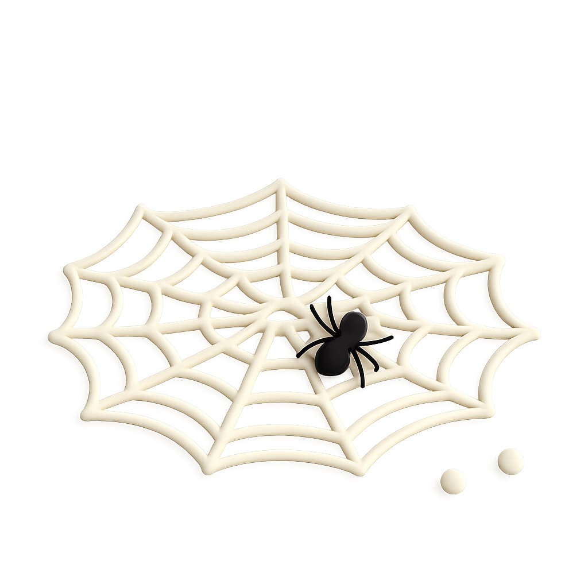

# Web Engineering & Development (SWE 363) 
### Hasan Al-kaf


 ---

 <!-- 
Before we start let's get to know you ..
 -->

<!-- _class: activity -->


> Activity ~15 mins
# Knowing each other 
- Name, Major 
- What do you know about Web Development?


---

<!-- These are the course learning outcomes .. -->

# Course Learning Outcomes:
By the end of this course you will be able to :

1. Identify candidate **tools and technologies** for developing web applications.
2. Recognize the **social impact and professional** responsibility towards web applications.
3. Conceptualize and recognize **design principles** in building front-end and back-end web applications.
4. **Build and publish** cross-platform, data-driven, and dynamic web applications.
5. Incorporate best practices to boost the **sustainability, usability, and accessibility** of web applications.

---


<!-- So what is the web? or the world wide web -->

So .. 
# What is the web?
*aka World Wide Web or WWW*


---

<!-- _class: light -->

# The web 
*A vast network of interconnected documents and resources, accessible via the **internet**, that allows users to share and access information globally.*


---

<!-- Ok what technologies make the web possible? -->

# What technologies makes the web possible?

---

<!-- _class: boxes -->
 

# What technologies makes the web possible?
- Internet
- HTTP 
- Servers 
- Clients 
- HTML 
- URLs

<!--  

---

Internet: A global network of interconnected computers that communicate using standardized protocols.
// 
HTTP: Hypertext Transfer Protocol, the foundation of data communication on the web, used for transmitting web pages.
// 
Servers: Computers or systems that provide resources, data, services, or programs to other computers, known as clients, over a network.
// 
Clients: Devices or programs that request and use resources or services from a server.
// 
HTML: Hypertext Markup Language, the standard language for creating and designing web pages and web applications.
// 
URLs: Uniform Resource Locators, the addresses used to access resources on the internet. 

---

-->

---

<!-- This is a simple architecture of the web -->

# What makes a web application?
A web application is a software application that runs on a **web server** and is accessed through a **web client**. 

---

### Architecture of a simple web app
<!-- _class: graph -->
<!-- footer: | -->

```
┌─────────────────┐    HTTP Request     ┌─────────────────┐
│                 │ ──────────────────► │                 │
│    CLIENT       │                     │    SERVER       │
│   (Browser)     │                     │   (Python/      │
│                 │                     │    Node.js/     │
│ ┌─────────────┐ │                     │    etc.)        │
│ │   HTML      │ │                     │                 │
│ │   CSS       │ │                     │ ┌─────────────┐ │
│ │ JavaScript  │ │                     │ │   Routes    │ │
│ └─────────────┘ │                     │ │   Logic     │ │
│                 │                     │ │   Database  │ │
│ ┌─────────────┐ │                     │ └─────────────┘ │
│ │ User Input  │ │                     │                 │
│ │ Interactions│ │                     │ ┌─────────────┐ │
│ └─────────────┘ │                     │ │   API       │ │
│                 │    HTTP Response    │ │ Endpoints   │ │
│                 │ ◄────────────────── │ └─────────────┘ │
└─────────────────┘                     └─────────────────┘
```


---

<!-- _class: activity -->

> Activty ~10m

## github.com/Web-Engineering-KFUPM/web_course_main
- visit the link
- Star the repository
- Explore the repository 
- Read the syllabus 
- Ask questions 

---

<!-- _class: demo -->

> Demo ~30m
# Building a real web app
- Go to our repo (also found in BB)
- Clone the project 
- Run the starter 
- Complete the code 
- Push to Github 


---

# Next Class 

- History of the web 
- HTML, CSS & JS 
- Infrastructure of the web


