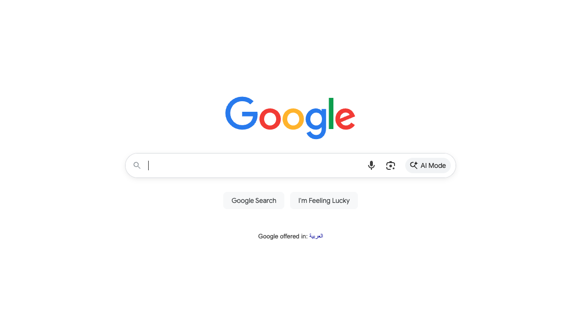

Web Engineering & Development (SWE 363) 
# Introduction to Web Development  
### Hasan Al-kaf
---

<!-- 

Goal: Give introduction to some important concepts.
- Ip addresses
- DNS
- URLs
- HTTP
- HTML, CSS & JS 

How: Give them the whole journey from a request until a response 

Practical: Let them investigate the request <> response journey themselves 

Subgoals: Join Slack, Notice BB, Start looking for groups.  
 
-->

# Announcements 📣

- Join Slack
- Join the Common section 
- Start looking for a project team 


---

# Today's plan: 

We will explore the journey of an HTTP request. In particular: 

- HTTP Requests
- HTTP Responses
- IP addresses
- DNS (Domain names system)
- URLs (Uniform Resource Locator)
- intro to HTML, CSS & JS


---

<!-- _class: activity -->

>~10m
# Explore it yourself 
- Go to google.com
- Right click > inspect 
- Search for any keyword (e.g. KFUPM)
- Notice: # requets, requests latecny, type of resource requested, size of response)



---

# What happens when we Google "KFUPM"? 
- Where does our request be **directed**?
- How does it know the **path**?
- How does it ask for specific **results**?
- How are the results **displayed**?
---

<!-- NEEDS VIZ -->

# The Journey of a Web Request 🌐

1. User types **URL**
2. **DNS** Lookup
3. **IP Address** Found
5. HTTP **Request** Sent
7. HTTP **Response**
8. Browser **Renders** Page

---

<!-- Explain each part  -->

# 1. User types a URL 
## https://www.google.com/search?q=kfupm

- Shceme
- Hostname
- Path
- Query string


---

# 2. DNS Lookup

• **Browser** checks its **cache** first  
• If not found, check **OS cache**  
• If not found, check **router cache**  
• If not found, ask **ISP DNS server**  
• **ISP** asks **Root DNS servers**  
• **Root** points to **TLD servers** (.com)  
• **TLD** points to **authoritative server**  
• **Authoritative server** returns **IP address**  
• **Result** is **cached** at all levels  


---

# 3. IP Address found 

Google.com -> 172.217.18.36

- A unique number that **identifies** each computer using the Internet Protocol to communicate over the internet


---

# 4. HTTP Request Sent 
```
┌─────────────────────────────────────────────────────────────┐
│                    HTTP REQUEST                             │
├─────────────────────────────────────────────────────────────┤
│ GET /search?q=KFUPM HTTP/1.1                                │
│ Host: google.com                                            │
│ User-Agent: Mozilla/5.0 (Windows NT 10.0; Win64; x64)       │
│ Accept: text/html,application/xhtml+xml,application/xml     │
│ Accept-Language: en-US,en;q=0.9                             │
│                                                             │
│ [Empty body for GET request]                                │
└─────────────────────────────────────────────────────────────┘
```

---

# 5. HTTP Response Recieved


```
┌─────────────────────────────────────────────────────────────┐
│                    HTTP RESPONSE                            │
├─────────────────────────────────────────────────────────────┤
│ HTTP/1.1 200 OK                                             │
│ Date: Mon, 26 Aug 2024 12:34:56 GMT                         │
│ Content-Type: text/html; charset=UTF-8                      │
│ Content-Length: 10240                                       │
│ Connection: keep-alive                                      │
│                                                             │
│ <!DOCTYPE html>                                             │
│ <html>                                                      │
│   <head><title>Search results for KFUPM</title></head>      │
│   <body>... (HTML content) ...</body>                       │
│ </html>                                                     │
└─────────────────────────────────────────────────────────────┘
```


---

# 6. Browser Renders Page

Response is returned in HTML, CSS and JS

---

# A Simple HTML Page
```html
<!doctype html>
<html>
  <head>
    <style>
      body { background-color: lightblue; }
    </style>
  </head>
  <body>
    Hello, world!
    <script>
      console.log('Hello from JavaScript!');
    </script>
  </body>
</html>
```
---

<!-- _class: demo -->
>30 mins
# Build a simple HTML page 
- Pull the latest changes from the Repo
- Go to demo 1.2 hello html
- Read the instrutions in the README.md file

---

# Thank you
Next class:
- HTML Document
- Basic HTML Tags
- HTML Lists
- HTML Tables 
- HTML Images

